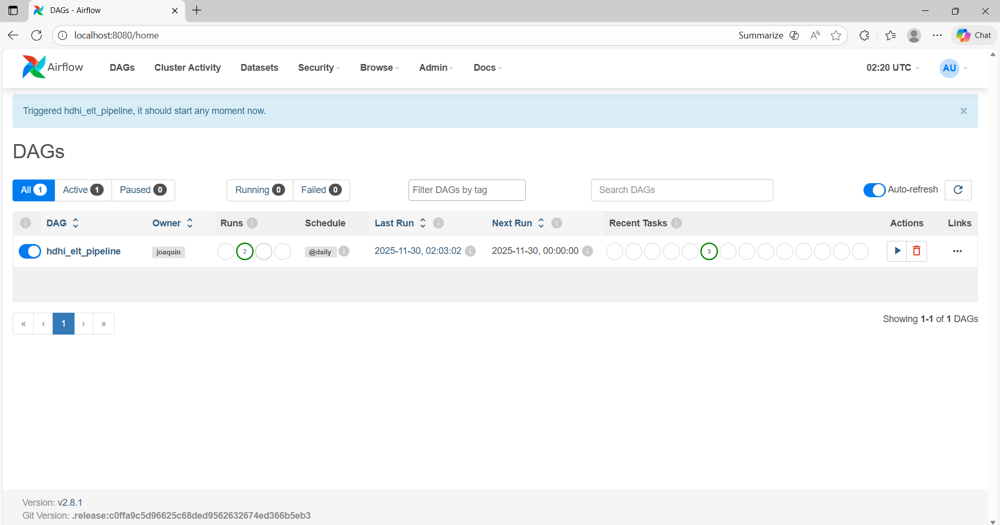
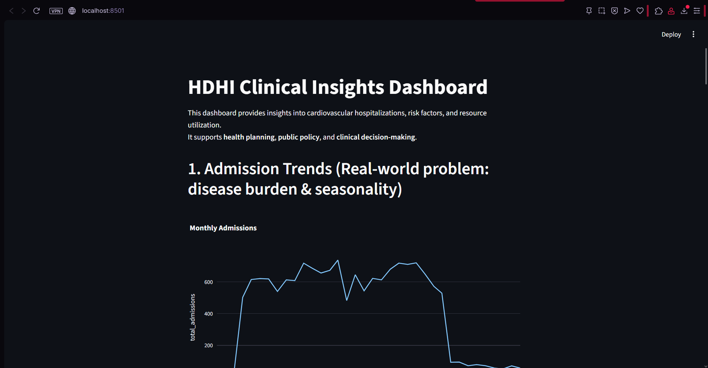
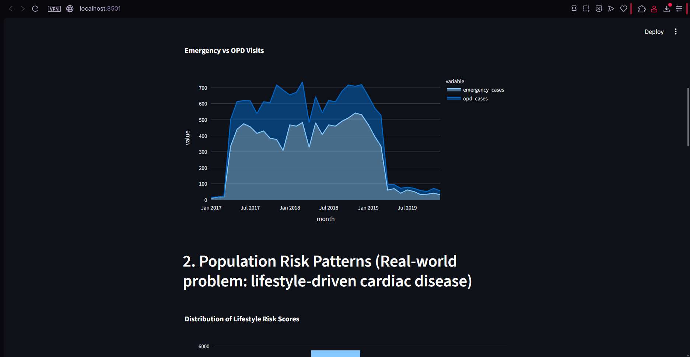
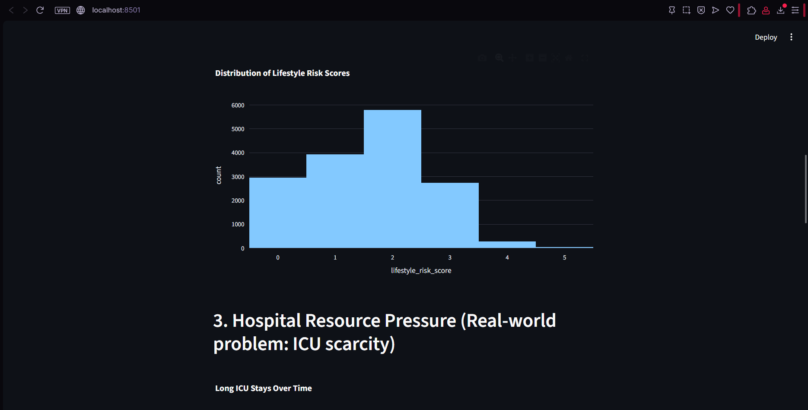

# HDHI ELT Pipeline & Clinical Dashboard

## 1. Dataset Justification (Phase 1)

This data was collected from patients admitted over a period of two years (1 April 2017 to 31 March 2019) at Hero DMC Heart Institute, Unit of Dayanand Medical College and Hospital, Ludhiana, Punjab, India. This is a tertiary care medical college and hospital. During the study period, the cardiology unit had 14,845 admissions corresponding to 12,238 patients. 1921 patients who had multiple admissions.

Specifically, data were related to patients ; date of admission; date of discharge; demographics, such as age, sex, locality (rural or urban); type of admission (emergency or outpatient); patient history, including smoking, alcohol, diabetes mellitus (DM), hypertension (HTN), prior coronary artery disease (CAD), prior cardiomyopathy (CMP), and chronic kidney disease (CKD); and lab parameters corresponding to hemoglobin (HB), total lymphocyte count (TLC), platelets, glucose, urea, creatinine, brain natriuretic peptide (BNP), raised cardiac enzymes (RCE) and ejection fraction (EF). Other comorbidities and features (28 features), including heart failure, STEMI, and pulmonary embolism, were recorded and analyzed.

Such information is crucial for understanding patterns in cardiovascular risk, metabolic instability, emergency care demand, and hospitalization burden.

**Real-World Problem Addressed**

This dataset helps address the challenge of understanding and predicting hospital workload, patient risk, and health-system pressure. By analyzing admissions, comorbidities, and lab abnormalities, health institutions can identify trends in:

- Metabolic disorders

- Cardiac distress

- Emergency care usage

- Length of stay and resource consumption

- Seasonal variations in hospital demand

**Who Benefits From This Analysis?**

Public health authorities – to detect population-level risk patterns and high-burden conditions

Hospital administrators – to allocate beds, ICU capacity, and emergency response resources

Clinical teams – to identify early warning signs of metabolic or cardiac deterioration

Health policy makers – to understand community-level risks and plan interventions

Researchers – to model predictive risks and analyze disease burden trends

## 2. Why ELT Is the Ideal Approach

- ELT (Extract → Load → Transform) is the best strategy for this dataset because:

- The dataset will continue growing over time as new admissions occur.

- Raw medical data must be preserved exactly as received for auditability and future reprocessing.

- Transformations evolve — new clinical rules, thresholds, or feature engineering may be added later without re-extracting the data.

- ELT allows heavy transformations to run inside the data warehouse, taking advantage of Postgres’ performance.

- It ensures traceability, separating raw data (hdhi_raw) from curated analytics tables (analytics_hdhi_clean, analytics_hdhi_dashboard).

## 3. Installation & Execution Instructions
Clone the repository
```bash
git clone https://github.com/JoaquinMO17/Pipeline_Airflow_Hospital.git
cd Pipeline_Airflow_Hospital
```

**Requirements**

- Docker & Docker Compose

- Python 3.9+

- Apache Airflow (via Docker Compose)

- Postgres

**Start the Airflow environment**
```bash
docker-compose up -d
```

**Access Airflow UI**

URL: http://localhost:8080

Default credentials:

- User: airflow

- Password: airflow

**Run the DAG**

In Airflow UI:

Locate: hdhi_elt_pipeline

Enable it (toggle ON)

Trigger DAG

# 4. Architecture Overview

                    ┌──────────────┐
                    │  Source CSV  │
                    └──────┬───────┘
                           │ Extract
                           ▼
                  ┌──────────────────┐
                  │   hdhi_raw       │  <-- Raw data, unchanged
                  └────────┬─────────┘
                           │ Load
                           ▼
                ┌──────────────────────┐
                │ analytics_hdhi_clean │  <-- Typed, cleaned, standardized
                └────────┬─────────────┘
                           │ Transform
                           ▼
            ┌────────────────────────────┐
            │ analytics_hdhi_dashboard   │  <-- Summaries for visualization
            └─────────────┬──────────────┘
                          Dashboard
                           ▼
                  ┌─────────────────┐
                  │ Streamlit App   │
                  └─────────────────┘

# 5. Evidence









# 6. Dashboard & Insights

The dashboard visualizes key clinical and operational indicators:

- Emergency vs. OPD trends

- Metabolic and cardiac risk over time

- Length-of-stay distribution

- ICU utilization patterns

- Seasonal admission trends

- Lifestyle comorbidity scoring

Visible insights in the screenshots provided tell us that from March 2017 to March 2019, there was a high volume of patients at the hospital, where opd cases (non-interned patients) were more common, but emergency cases weren't rare either. Another clear insight is that around 13000 patients (out of the ~15700 total ones) have a lifestyle risk score of 2 or less, but almost 6000 of them have a score of 2, meaning that, while it seems the majority of patients live relatively low-risk lifestyles, 6000 of them do 2 among smoking, drinking, have diabetes, hypertension or coronary artery disease. Suggesting medium risk for around 38% of the total patients and potential increase of average lifestyle risk going forward.


# 7. Running the Dashboard

Inside the repository:
```bash
cd dashboard
pip install -r requirements.txt
streamlit run app.py
```

Dashboard runs at:

http://localhost:8501

